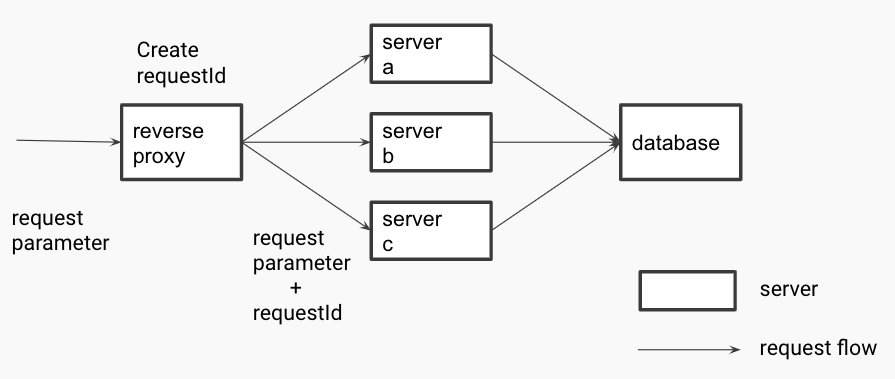

# 問1

とあるウェブサービスを運用しています。
このウェブサービスのアーキテクチャでは、リクエストに応じて後続のサーバにリクエストの振り分け処理を行うリバースプロキシと、それぞれ異なる機能を持つサーバ `a`, `b`, `c` 及び、これらのサーバからデータの読み書きリクエストが行われるデータベースで構成されています。
このウェブサービスのアーキテクチャの性能改善を行いたいと考えています。

## 小問A

このサーバ群のサーバログをそれぞれ取得しており、サンプリングしたものが [logs/](logs/) 配下に得られています。
リクエスト・レスポンスの処理の流れとサーバログの仕様は以下の通りです。

- リバースプロキシはクライアントから受け取ったリクエストに対してユニークな ID `requestId` を発行する
- リバースプロキシはリクエストに応じて後続のサーバ (`a`, `b`, `c`) のいずれかに `requestId` を付与したリクエストを転送するとともに、`requestId` とその時の時刻 `time` をログに書き込む
- サーバ (`a`, `b`, `c`) はリバースプロキシから受け取ったリクエストを処理する
- サーバ (`a`, `b`, `c`) は処理完了後にレスポンスをリバースプロキシに送信するとともに、`requestId` とその時の時刻 `time` をログに書き込む
- リバースプロキシはサーバ (`a`, `b`, `c`) から受け取ったレスポンスをクライアントに送信する

サーバ (`a`, `b`, `c`) の中で、サーバの処理時間の平均値が最も長いサーバはどれか、サーバログから導出してください。
なお、サーバ間のネットワーク通信における時間は無視できるものとします。

## 小問B

小問 A のサーバについて調査を進めたところ、接続しているデータベースに対するリクエストがボトルネックになっていることが分かりました。
また、小問 A のサーバのアプリケーション要件とリクエストの性質は、以下のようになっていることが分かっています。

- データベースのレコードの読み取りリクエストのみが行われる
- データベースのレコードによってリクエスト負荷に大きなばらつきがある
- データベースのレコードの読み取り結果は結果整合性を満たしていれば良い

この時、単位時間あたりのリクエスト処理数を上げ、かつアプリケーションの信頼性を上げるために、データベースに講じる手段として、以下の選択肢のうち最も適切なものを一つ選んでください。

1. データベースのスケールアップを行う
2. データベースのパーティショニングを行う
3. データベースのリードレプリカを複数作る
4. データベースを複数のシャードに分割する
